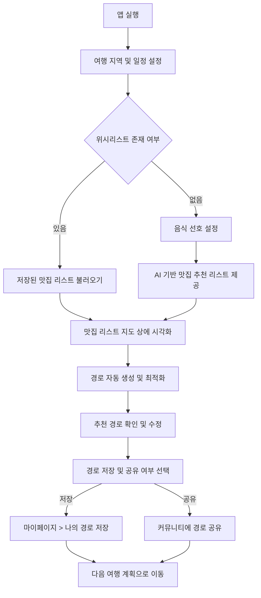
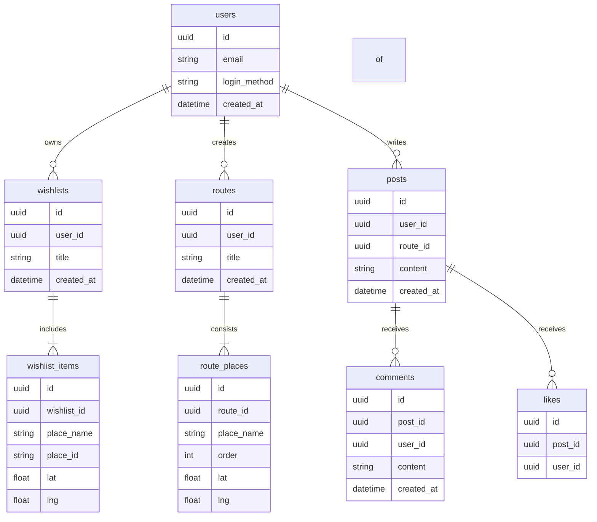

**Software Requirements Specification (SRS) / 소프트웨어 요구사항 명세서**
_Based on IEEE Std 830-1998 / IEEE 표준 830-1998 기반_

---

# 1. Introduction / 소개

## 1.1 Purpose / 목적

본 문서는 “잇고(EatGo)” 서비스에 대한 소프트웨어 요구사항 명세서(SRS)로, 사용자 맞춤형 미식 여행 경로를 설계할 수 있는 기능을 중심으로 서비스의 전반적인 요구사항을 정의한다. 본 문서는 기획자, 개발자, 디자이너 등 팀 구성원이 공통된 이해를 바탕으로 협업할 수 있도록 기준을 제공하며, 향후 유지보수 및 기능 확장의 기준점으로 활용된다.

## 1.2 Scope / 범위

잇고는 사용자가 직접 선택한 맛집 리스트를 기반으로, 효율적인 동선의 여행 경로를 자동으로 설계하고 시각화해주는 미식 여행 특화 서비스다. 사용자는 일정 및 지역 설정을 통해 자신만의 여행을 계획할 수 있으며, 저장된 리스트와 위치 정보를 기반으로 한 최적 경로 추천, 주변 관광지 연계, 경로 공유, 커뮤니티 기능을 제공받는다.

본 소프트웨어는 모바일 기반 앱(iOS/Android)으로 제공되며, 일부 기능은 웹에서도 제공 가능하다. 맛집 탐색, 여행 일정 구성, 커뮤니티 공유 기능이 통합된 식도락 여행 전용 플랫폼이다.

## 1.3 Definitions, Acronyms, and Abbreviations / 용어 정의 및 약어

-   **EatGo**: 본 서비스를 지칭하는 명칭으로, '맛집을 잇는 여행'이라는 의미를 내포함
-   **POI (Point of Interest)**: 사용자가 관심 있는 장소(맛집, 관광지 등)
-   **위시리스트**: 사용자가 사전에 저장해둔 방문 희망 맛집 리스트
-   **경로 추천**: 맛집 간의 최적 동선을 계산하여 사용자에게 제안하는 기능

## 1.4 References / 참조 문서

-   2025 관광 트렌드 리포트
-   한국관광공사 관광 데이터 API 명세서
-   Kakao Local API / 지도 SDK 문서
-   기타 관련 공공데이터 API 명세서

## 1.5 Overview / 개요

이 문서는 다음과 같이 구성된다:

-   2장: 서비스의 전반적인 설명 (시스템 구조, 사용자 특성 등)
-   3장: 기능 및 비기능 요구사항 상세 정의
-   4장: 부록 및 참고 정보

---

# 2. Overall Description / 전체 설명

## 2.1 Product Perspective / 제품 개요

EatGo는 독립형 모바일 애플리케이션으로, 외부 지도 API 및 공공데이터 API와 연동하여 사용자 맞춤형 여행 경로를 자동 설계하는 시스템이다. Kakao 지도 플랫폼을 기반으로 경로를 시각화하고, 사용자의 취향과 위치 정보를 기반으로 최적화된 추천 기능을 제공한다.

## 2.2 Product Functions / 제품 기능 요약

1. **맛집 리스트 등록 및 저장**
2. **사용자 맞춤형 최적 여행 경로 자동 생성**
3. **반경 내 스와이프형 맛집 추천 및 필터 기능**
4. **지역 관광지 및 특화 거리 추천**
5. **사용자 여행 경로 저장 및 공유 기능**
6. **카카오맵 위시리스트 불러오기 및 연동**
7. **커뮤니티 기반 경로 피드백 및 추천 기능**

## 2.3 User Classes and Characteristics / 사용자 분류 및 특성

1. **일반 사용자**: 맛집 탐색 및 여행 경로 생성, 공유 가능
2. **경로 공유 사용자**: 자신의 여행 경로를 저장하고 커뮤니티에 공유 가능
3. **게스트 사용자**: 계정 없이 일부 기능 체험 가능
4. **관리자**: 사용자 관리, 추천 알고리즘 설정, 데이터 통계 분석 가능

## 2.4 Operating Environment / 운영 환경

-   **모바일 앱**: iOS 15 이상 / Android 10 이상
-   **프론트엔드**: React Native (Expo 기반)
-   **백엔드**: Django REST Framework
-   **지도 API**: Kakao Local/Map API
-   **데이터 API**: 한국관광공사 관광 빅데이터, 방문자 추이 API
-   **서버 인프라**: AWS 또는 Render 기반 클라우드 환경, Docker 기반 배포

## 2.5 Design and Implementation Constraints / 설계 및 구현 제약사항

-   모바일 앱은 React Native 기반의 코드베이스로 개발되어야 함
-   위치/경로 계산은 KakaoMap API만 사용 가능
-   데이터 저장 위치는 개인정보 보호법 및 GDPR을 준수해야 함
-   사용자 인증은 카카오 로그인 또는 자체 OAuth 2.0 기반 인증 체계 활용

## 2.6 User Documentation / 사용자 문서

-   앱 온보딩 튜토리얼
-   사용 가이드 (위시리스트 등록, 경로 추천 등)
-   FAQ 및 오류 해결 안내
-   관리자 가이드 (웹용)
-   GitBook 기반 공식 문서화

## 2.7 Assumptions and Dependencies / 가정 및 의존성

-   사용자는 인터넷이 연결된 환경에서 앱을 사용할 것
-   사용자는 위치정보 제공 및 권한을 허용한 상태일 것
-   Kakao API, 한국관광공사 API는 안정적으로 제공될 것
-   사용자는 카카오 계정이 있거나 이메일 로그인 가능해야 할 것

---

# 3. Specific Requirements / 세부 요구사항

## 3.1 External Interfaces / 외부 인터페이스

### 3.1.1 User Interfaces / 사용자 인터페이스

-   React Native 기반 앱 인터페이스
-   스와이프 카드형 추천 UI, 리스트 UI, 지도 핀 표시 UI
-   웹 기반 관리자 대시보드 (React.js)

### 3.1.2 Hardware Interfaces / 하드웨어 인터페이스

-   GPS 모듈: 위치 기반 서비스 제공을 위해 필요

### 3.1.3 Software Interfaces / 소프트웨어 인터페이스

-   Kakao Local/Map API
-   한국관광공사 공공데이터 API
-   카카오 로그인 API, 공유 API
-   내부 REST API 서버

### 3.1.4 Communication Interfaces / 통신 인터페이스

-   HTTPS 기반 REST API (JSON 포맷)
-   외부 API 비동기 호출 지원

## 3.2 Functional Requirements / 기능 요구사항

-   FR-1: 사용자는 맛집을 검색하고 위시리스트에 추가할 수 있어야 한다
-   FR-2: 사용자는 위시리스트 기반으로 경로 추천을 요청할 수 있어야 한다
-   FR-3: 시스템은 맛집 간 최적 동선을 계산하여 시각화해야 한다
-   FR-4: 사용자는 반경 내 맛집을 스와이프 UI로 탐색할 수 있어야 한다
-   FR-5: 시스템은 선택된 경로에 대해 관광지 및 특화 거리 정보를 제안해야 한다
-   FR-6: 사용자는 생성된 경로를 저장 및 공유할 수 있어야 한다
-   FR-7: 시스템은 다른 사용자의 공유 경로를 검색/열람할 수 있어야 한다
-   FR-8: 관리자는 관리자 대시보드를 통해 사용자 및 콘텐츠를 관리할 수 있어야 한다

## 3.3 Performance Requirements / 성능 요구사항

-   평균 응답 시간: 2초 이내
-   경로 생성 시간: 3초 이내
-   동시 사용자 5,000명 이상 지원 가능해야 함

## 3.4 Logical Database Requirements / 논리 데이터베이스 요구사항

-   사용자 테이블 (id, 이메일, 로그인 방식, 가입일 등)
-   맛집 정보 테이블 (API 연동된 POI 정보 저장)
-   위시리스트 및 경로 테이블 (사용자별 저장 리스트, 공유 여부)
-   커뮤니티 피드 테이블 (경로 공유, 좋아요, 댓글 등)

## 3.5 Design Constraints / 설계 제약사항

-   Expo 기반 React Native 앱으로만 개발 가능
-   지도는 Kakao API만 활용 가능 (Google Maps 사용 불가)

## 3.6 Software System Attributes / 소프트웨어 시스템 속성

### 3.6.1 Reliability / 신뢰성

-   주요 API 장애 시 fallback 처리 필요

### 3.6.2 Availability / 가용성

-   월간 99.9% 이상 가용성 보장

### 3.6.3 Security / 보안

-   OAuth 2.0 기반 인증 체계, 사용자 데이터 암호화 저장

### 3.6.4 Maintainability / 유지보수성

-   기능별 모듈화, 단위 테스트 80% 이상

### 3.6.5 Portability / 이식성

-   iOS/Android 플랫폼 간 동일 코드베이스 사용

---

# 4. Appendices / 부록

## 4.1 Glossary / 용어 설명

| 용어          | 정의                                  |
| ------------- | ------------------------------------- |
| POI           | 관심 장소(맛집, 관광지 등)            |
| 위시리스트    | 사용자가 저장한 맛집 목록             |
| 경로 추천     | 사용자 위치 기반 최적 동선 제안 기능  |
| 스와이프 추천 | Tinder 스타일의 카드형 UI로 맛집 탐색 |

## 4.2 Open Issues / 미해결 항목

| 이슈 ID | 항목                 | 설명                                                       | 우선순위 |
| ------- | -------------------- | ---------------------------------------------------------- | -------- |
| OI-2    | 서버 인프라          | AWS or Render 선택 및 구성 계획 수립 필요                  | 중간     |
| OI-3    | 경로 최적화 알고리즘 | 거리 + 이동시간 + 특산물/관광지 고려한 계산 방식 확정 필요 | 높음     |

## 4.3 User Flow Diagram / 사용자 플로우 다이어그램

## 4.4 Entity Relationship Diagram / ERD (데이터베이스 관계도)

---

_End of IEEE SRS Template / IEEE SRS 템플릿 종료_
